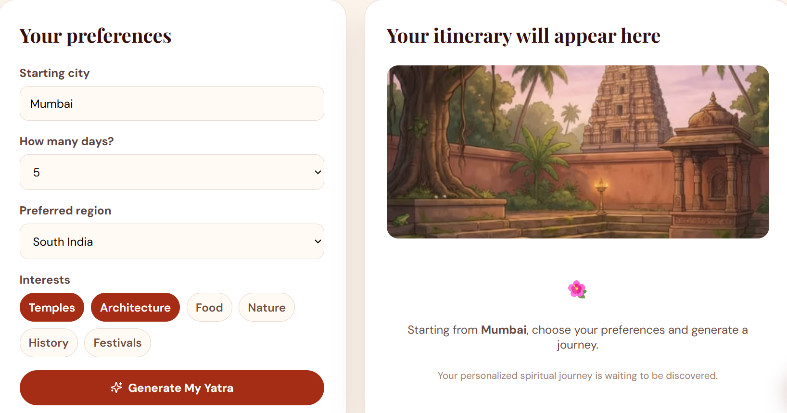
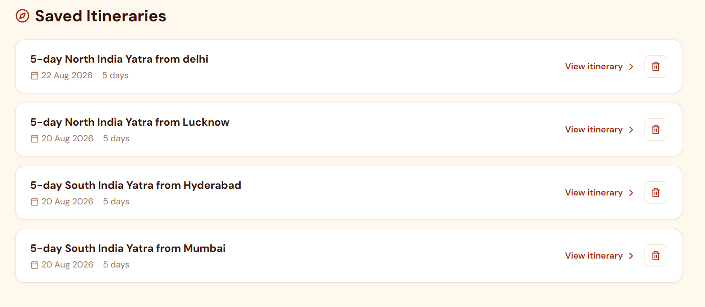

# 🛕 Temple Heritage

### Discover India's Sacred Heritage Through Technology

Temple Heritage is a modern web platform designed to help users explore India's temples, cultural heritage, festivals, and spiritual journeys in one place.

The platform combines a curated temple experience with AI-powered itinerary planning, allowing users to create personalized spiritual journeys based on their starting city, preferred region, travel duration, and interests.

---

## ✨ Features

### 🏛️ Explore Sacred Temples
Discover temples and learn about their:

- History and cultural significance
- Architecture
- Location and region
- Spiritual importance
- Associated festivals

### 🧭 AI-Powered Yatra Planner

Create a personalized spiritual itinerary by selecting:

- 📍 Starting city
- 📅 Number of travel days
- 🗺️ Preferred region
- ❤️ Personal interests

The AI generates a day-wise itinerary with realistic travel plans and temple recommendations.

### 🤖 Intelligent AI Planning

The planner uses Groq AI to generate personalized itineraries.

The system also includes:

- Structured JSON responses
- JSON validation
- Response normalization
- AI fallback itineraries
- Rate limiting
- Error handling
- Protection against invalid AI responses

### 📅 Festivals

Explore important Indian temple festivals and cultural celebrations.

### ❤️ Save Your Favourite Temples

Users can save temples and access them later from their personal collection.

### 👤 Authentication & Profile

The application includes:

- User signup
- Login
- Logout
- Profile management

### 📜 My Yatras

Users can access previously generated spiritual journeys and revisit their personalized itineraries.

### 📄 Downloadable Itinerary

Generated Yatras can be downloaded as a formatted itinerary report.

---

## 🖥️ Screenshots

### 🏠 Home Page


### 🧭 AI Yatra Planner



### 🛕 Generated Itinerary



---

## 🛠️ Tech Stack

| Technology | Purpose |
|---|---|
| Next.js | Full-stack React framework |
| TypeScript | Type-safe development |
| React | User interface |
| CSS | Styling and responsive design |
| Groq API | AI-powered itinerary generation |
| Node.js | Server-side runtime |
| Next.js API Routes | Backend API endpoints |

---

## 🧠 How the AI Planner Works

```text
User Preferences
       │
       ▼
┌──────────────────────┐
│ Starting City        │
│ Number of Days       │
│ Preferred Region     │
│ Travel Interests     │
└──────────┬───────────┘
           │
           ▼
   Temple Context
           │
           ▼
     Groq AI Model
           │
           ▼
  JSON Validation
           │
           ▼
 Response Normalization
           │
           ▼
 Personalized Yatra
           │
           ▼
 Downloadable Itinerary

## 👩‍💻 Author

**Aarya Shirsath**  
Developer & Creator ✨

## 🌸 A Little Note

Temple Heritage was built with the idea of bringing together **technology, culture, spirituality, and heritage**.

What started as a project slowly became something more meaningful — a small digital space where people can explore India's sacred heritage and create journeys of their own.

Every temple has a story.  
Every journey creates a memory.  
And sometimes, technology can help us discover both. ✨

Made with ❤️, curiosity, and a little bit of magic.